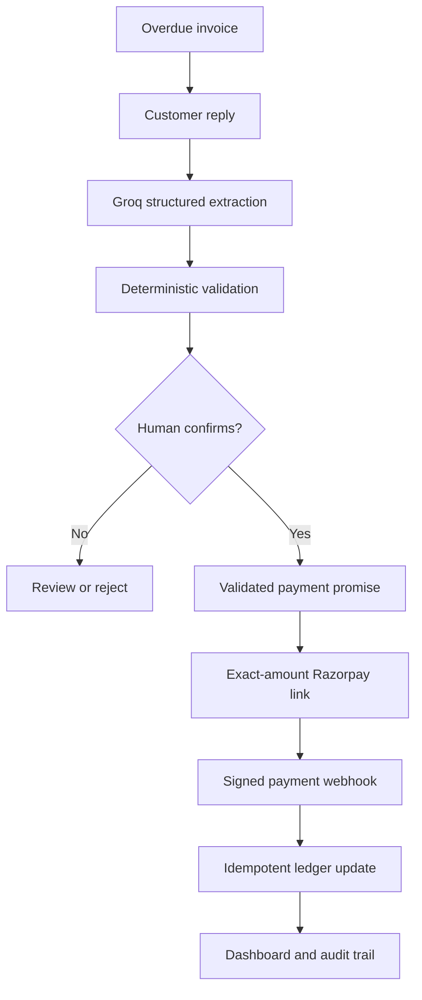

# Promise-to-Pay Recovery Orchestrator

A guarded receivables-recovery system for small merchants that turns unstructured customer commitments into validated payment promises, exact-amount Razorpay Payment Links, and an auditable recovery workflow.

The core product insight is simple: **recovering an invoice is not only about retrying a failed transaction; it is about tracking what the customer promised, when they promised it, and whether that promise was fulfilled.**

> This project uses Razorpay Test Mode. It does not process real money.

## What it does

The system accepts an overdue invoice and a customer response such as:

> I can pay 40k this Friday. The other 8k is disputed.

It then:

1. Extracts the promised amount, date, dispute, intent, and exact evidence using Groq.
2. Grounds every evidence quote against the original message.
3. Resolves supported relative weekday phrases deterministically.
4. Checks that promised and disputed amounts do not exceed the outstanding balance.
5. Requires human confirmation before creating financial state.
6. Creates an exact-amount Razorpay Payment Link.
7. Verifies signed Razorpay webhooks over the raw request body.
8. Applies a successful payment exactly once.
9. Tracks broken promises and missed webhooks.
10. Records every important decision in an audit ledger.

## Why this is different

Typical payment recovery tools focus on transaction retries or generic reminders. This project focuses on **promise-to-pay state** in B2B receivables:

- What amount did the customer commit to?
- What amount did they dispute?
- What exact language supports the interpretation?
- When is the promise due?
- Was the corresponding payment actually received?
- Can every automated decision be reconstructed later?

The LLM proposes structured information. Deterministic code controls evidence grounding, date resolution, financial limits, state transitions, idempotency, and payment application.

## End-to-end workflow



## Safety controls

### Exact evidence grounding

The model must copy evidence character-for-character from the customer message. Each quote must be a contiguous substring.

If the source says `40k`, the model cannot claim that `₹40,000` was the quoted evidence.

### Deterministic date resolution

Supported weekday phrases follow written rules:

- `Friday` and `this Friday` mean the first Friday strictly after the message timestamp.
- `next Friday` means seven days after that first future Friday.
- A message sent on Friday resolves `this Friday` to the following Friday.
- Multiple weekdays, unsupported date expressions, or ambiguous phrases require review.

The default business timezone is `Asia/Kolkata`.

### Financial guardrails

The backend verifies:

- Promised amounts are positive.
- Disputed amounts are non-negative.
- Promised plus disputed money does not exceed the invoice balance.
- A paid amount matches the exact promise.
- A payment cannot exceed the remaining outstanding balance.
- Unexpected partial payments on exact-amount links go to human review.

### Human confirmation

Extraction is only a preview. The system does not create a payment promise or Payment Link until a human reviews and confirms the structured result.

### Webhook security

- HMAC-SHA256 is verified over the exact raw body.
- Verification happens before JSON parsing.
- Signature comparison uses `hmac.compare_digest`.
- `X-Razorpay-Event-Id` is mandatory.
- Event IDs are stored as primary keys to prevent replay.
- Payment application and webhook recording occur within a database transaction.

### Missed-webhook reconciliation

If Razorpay reports a link as paid but the webhook was unavailable, the reconciliation workflow can fetch provider state and apply the payment safely. Repeated reconciliation cannot double-count an already-applied payment.

### Deadline handling

The deadline worker marks unpaid `VALIDATED` or `LINK_CREATED` promises as `BROKEN` only after their full promise date has passed.

Repeated execution is idempotent, and completed payments cannot be marked broken.

## State model

### Invoice states

- `OVERDUE`
- `PARTIALLY_PAID`
- `DISPUTED`
- `PAID`
- `HUMAN_REVIEW`

### Promise states

- `PROPOSED`
- `VALIDATED`
- `LINK_CREATED`
- `PAID`
- `BROKEN`
- `HUMAN_REVIEW`

## Technology

### Backend

- Python
- FastAPI
- SQLAlchemy
- PostgreSQL
- Pydantic
- Groq structured generation

### Payment integration

- Razorpay Payment Links
- Razorpay Test Mode
- Signed webhooks
- Idempotent event processing
- Provider reconciliation

### Frontend

- React
- TypeScript
- Vite
- Responsive CSS
- Five-second status polling while a link is awaiting payment

### Evaluation

- Pytest
- Frozen adversarial extraction cases
- Frozen workflow-safety scenarios

## Repository structure

```text
app/
├── routes/
│   ├── extraction.py
│   ├── invoices.py
│   ├── jobs.py
│   ├── promises.py
│   └── webhooks.py
├── services/
│   ├── audit.py
│   ├── deadline_worker.py
│   ├── payment_application.py
│   └── promise_extractor.py
├── contracts.py
├── database.py
├── models.py
├── razorpay_client.py
└── schemas.py

frontend/
├── src/
│   ├── App.tsx
│   ├── App.css
│   ├── api.ts
│   └── types.ts
└── vite.config.ts

evals/
├── promise_extraction_cases.json
├── workflow_safety_cases.json
└── results/

scripts/
├── evaluate_promise_extraction.py
├── evaluate_workflow_safety.py
└── seed_demo_invoice.py

tests/
```

## Local setup

### Requirements

- Python 3.12+
- Node.js 20+
- Docker
- Razorpay Test Mode account
- Groq API key

### 1. Install backend dependencies

```bash
python3 -m venv .venv
source .venv/bin/activate

pip install -r requirements.txt
pip install -r requirements-dev.txt
```

### 2. Configure environment variables

```bash
cp .env.example .env
```

Fill in the Razorpay Test Mode credentials, webhook secret, and Groq API key.

Never commit `.env`.

### 3. Start PostgreSQL

```bash
docker compose up -d db

docker compose exec db \
  pg_isready -U postgres -d recovery
```

### 4. Start FastAPI

```bash
python -m uvicorn app.main:app \
  --reload \
  --port 8000 \
  --env-file .env
```

Verify:

```bash
curl http://127.0.0.1:8000/health
```

API documentation is available at:

```text
http://127.0.0.1:8000/docs
```

### 5. Configure the Razorpay webhook

Expose port `8000` through a public HTTPS URL.

Configure this URL in the Razorpay Test Mode dashboard:

```text
https://your-public-host/webhooks/razorpay
```

Use the same webhook secret stored in `RAZORPAY_WEBHOOK_SECRET`.

Subscribe to:

- `payment_link.paid`
- `payment_link.partially_paid`

The public endpoint must remain reachable while testing payments.

### 6. Start the frontend

```bash
cd frontend
npm install
npm run dev
```

Open:

```text
http://127.0.0.1:5173
```

Vite proxies `/api` requests to FastAPI on port `8000`.

## Create a clean demo case

With FastAPI running:

```bash
python scripts/seed_demo_invoice.py
```

The command creates or reuses an untouched demo invoice:

- Customer: `Northstar Retail`
- Invoice: ₹48,000
- Initial state: `OVERDUE`
- Paid: ₹0
- Disputed: ₹0

Suggested customer reply:

```text
I can pay 40k this Friday. The other 8k is disputed.
```

Running the command again reuses the clean invoice instead of creating duplicates.

## Demo workflow

1. Open `Northstar Retail` in the recovery dashboard.
2. Paste the suggested customer reply.
3. Click **Extract promise**.
4. Review the intent, ₹40,000 promise, ₹8,000 dispute, resolved date, and exact evidence.
5. Click **Confirm promise**.
6. Create the Razorpay Payment Link.
7. Open the Test Mode link and complete the ₹40,000 payment.
8. Keep the webhook endpoint public.
9. Watch the dashboard change from `LINK_CREATED` to `PAID`.
10. Inspect the final ₹8,000 disputed balance and audit trail.

## Verification

### Backend test suite

```bash
python -m pytest -q
```

Latest verified result:

```text
42 passed
```

The remaining warning concerns a TestClient dependency deprecation and does not represent a failed test.

### Frontend checks

```bash
cd frontend

npm run lint
npm run build
```

### Frozen extraction evaluation

This evaluation calls Groq and therefore requires `GROQ_API_KEY`.

```bash
set -a
source .env
set +a

python scripts/evaluate_promise_extraction.py
```

Latest frozen smoke-set result:

- Cases: 10
- Evaluated: 10
- Passed: 10
- Case accuracy: 100%
- Field accuracy: 100%
- Evidence grounding: 100%

The script spaces requests to accommodate free-tier rate limits.

### Frozen workflow-safety evaluation

```bash
python scripts/evaluate_workflow_safety.py
```

Latest result:

- Frozen scenarios: 16
- Passed: 16
- Failed or missing: 0
- Safety-control pass rate: 100%

Evaluated controls include:

- Fabricated-evidence rejection
- Balance bounds
- Payment Link idempotency
- Webhook replay protection
- Amount-mismatch handling
- Unexpected partial-payment handling
- Missed-webhook reconciliation
- Provider-failure preservation
- Deadline idempotency
- Completed-payment protection
- Raw-body signature verification

## Honest limitations

- Razorpay is exercised in Test Mode, not with real funds.
- Customer messages are entered through the dashboard; WhatsApp or SMS ingestion is not implemented.
- The extraction dataset contains ten frozen adversarial smoke cases and is not evidence of broad production accuracy.
- The sixteen workflow scenarios form a safety smoke suite, not a formal verification.
- No claim is made about real-world payment-recovery uplift.
- Automated workflow tests use SQLite; PostgreSQL row locking has been exercised manually but not under concurrent load testing.
- Groq free-tier rate limits can slow evaluation runs.
- Relative-date parsing intentionally supports a narrow weekday contract rather than guessing arbitrary dates.
- A production deployment would require authentication, merchant isolation, encrypted secret storage, migrations, monitoring, and background-job infrastructure.

## Evaluation philosophy

The project does not treat a successful LLM response or a single recovered payment as proof of reliability.

The evaluation focuses on whether the system:

- Refuses unsafe or ambiguous actions.
- Grounds claims in the original customer message.
- Bounds every financial action.
- Applies money exactly once.
- Preserves an auditable state history.
- Handles a failed webhook or provider request safely.

The reported metrics describe only the checked frozen scenarios.