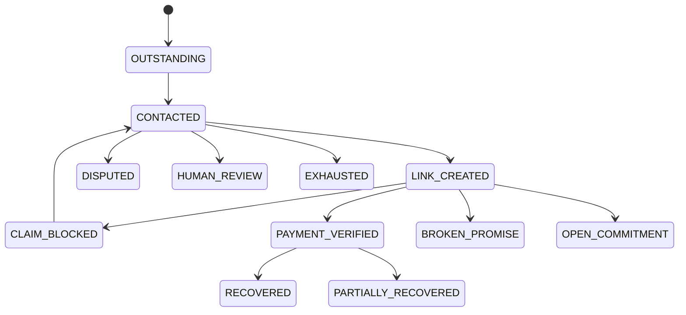

# Recovery Simulator V1 Design

## Purpose and claim boundary

The simulator is a deterministic test environment for recovery policy and
financial-state invariants. It does not predict how real customers will behave.
Its probabilities are deliberately visible, fictional, and uncalibrated.

The simulator may support statements such as:

> Under the frozen synthetic assumptions and seed 247, policy A produced these
> state transitions and metrics.

It must not support statements such as:

> Policy A will improve real merchant recovery by this percentage.

## Frozen scope

V1 contains exactly eight personas:

| Persona | Behavior represented |
|---|---|
| Cooperative full payer | Responsive customer able to settle completely |
| Partial payer | Customer able to pay only part of an exact-link balance |
| Chronic late payer | Frequent promises with a low synthetic keep rate |
| Dispute-heavy customer | Billing dispute rather than payment intent |
| Adversarial paid claimant | Unsupported claims that payment already occurred |
| Vague communicator | Replies without one defensible amount and date |
| Hindi-English customer | Clear code-switched commitments |
| Cash-flow constrained customer | Small delayed payment after salary |

`simulator/personas_v1.json` contains every parameter. Its lock stores the
SHA-256 hash and prevents quiet post-result tuning. There is no ninth persona,
reliability classifier, negotiation agent, bandit, or omnichannel behavior.

## Compared policies

| Policy | Behavior |
|---|---|
| `GENERIC_EXACT_LINK` | Sends the same full-balance exact link on a fixed contact cadence. It cannot adapt the link to a synthetic partial-payment commitment. |
| `PROMISE_AWARE_FIREWALL` | Interprets the synthetic response kind, requires confirmation where the current product does, creates an exact commitment link, schedules the synthetic due date, and routes disputes or ambiguity to a human. |

Both policies receive the same per-persona, per-episode random tape. The seed is
derived from the global seed, persona ID, and episode number. Policy control flow
therefore cannot change the random inputs presented to the other policy.

## State machine

Every episode begins `OUTSTANDING`. A transition guard raises an error if code
tries to skip required intermediate states—for example, moving directly from
`OUTSTANDING` to `RECOVERED`.

## Financial authority boundary

Customer behavior never writes `paid_amount_paise` or
`outstanding_amount_paise`. A successful synthetic payment performs the same
boundary sequence used by the application:

1. Persist a provider-event fixture in the trusted ledger.
2. Call production `apply_exact_payment`.
3. Let `FinancialActionFirewall` independently load and validate the event.
4. Apply the balance transition only after authorization.

The adversarial persona directly proposes `MARK_PAID` without an event. The
simulator counts the block and asserts that no balance changed.

The generic policy's initial validated promise is explicitly a simulation setup
fixture so the existing exact-link application path can be compared. It is not
presented as a production customer commitment.

## Metrics

The report includes simulated amount recovery, full and partial recovery,
contacts, time to resolution, confirmation burden, human escalation, broken
promises, blocked unsupported claims, policy violations, and false payment-state
changes. All recovery fields use the `simulated_` prefix where confusion with
observed data is plausible.

The committed report uses 100 episodes per persona per policy: 1,600 total
episodes. Running it twice must produce the same deterministic result hash.
